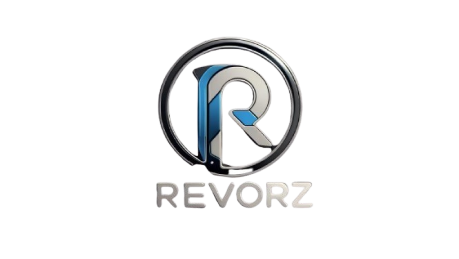

<div align="center">



# RevORz

### ⌚ Mendefinisikan Ulang Waktu

[](https://developer.mozilla.org/en-US/docs/Web/HTML)
[](https://tailwindcss.com/)
[](https://developer.mozilla.org/en-US/docs/Web/JavaScript)
[](./LICENSE)

**Landing page sinematik & premium untuk brand smartwatch RevORz.**
Terinspirasi dari gaya website produk mewah seperti Apple & Rolex.

[🔗 Live Demo](#) · [📸 Screenshots](#-screenshots) · [🚀 Mulai Cepat](#-mulai-cepat)

---

</div>

## ✨ Highlights

<table>
<tr>
<td width="50%">

### 🎬 Cinematic Experience
Video looping full-screen sebagai hero background dengan gradient overlay, menciptakan kesan sinematik khas brand mewah.

</td>
<td width="50%">

### 🌑 Dark Mode Premium
Latar belakang hitam pekat (`#050505`) mempertegas visual produk dan memberikan nuansa eksklusif.

</td>
</tr>
<tr>
<td width="50%">

### 💎 Glassmorphism Navbar
Navbar transparan yang berubah menjadi efek blur kaca saat di-scroll, mengikuti tren desain terkini.

</td>
<td width="50%">

### 🎭 Scroll Animations
Animasi fade-in & slide-up yang dipicu oleh **Intersection Observer** saat elemen memasuki viewport.

</td>
</tr>
</table>

---

## 📸 Screenshots

<div align="center">

| Hero Section | Product Highlight |
|:---:|:---:|
| Video sinematik full-screen | Floating animation smartwatch |
| Headline dengan gradient text | Spesifikasi dalam grid elegan |

</div>

> 💡 **Tip:** Buka `index.html` langsung di browser untuk melihat animasi dan interaksi secara langsung!

---

## 🏗️ Struktur Proyek

```
RevORz/
├── 📄 index.html                              # Landing page (single-file)
├── 📁 asset/
│   ├── 🖼️ logo-asset.png                      # Logo brand RevORz
│   ├── 🖼️ produk(jam-tanga)-asset-image.png   # Gambar produk smartwatch
│   └── 🎬 Video_Looping_Sinematik-asset.mp4   # Video hero background
└── 📄 README.md                               # Dokumentasi proyek
```

---

## 🎨 Design System

<table>
<tr>
<th>Token</th>
<th>Nilai</th>
<th>Preview</th>
</tr>
<tr>
<td><strong>Background</strong></td>
<td><code>#050505</code></td>
<td></td>
</tr>
<tr>
<td><strong>Aksen Utama</strong></td>
<td><code>#3b9be5</code></td>
<td></td>
</tr>
<tr>
<td><strong>Aksen Terang</strong></td>
<td><code>#75bdf3</code></td>
<td></td>
</tr>
<tr>
<td><strong>Teks Utama</strong></td>
<td><code>#FFFFFF</code></td>
<td></td>
</tr>
<tr>
<td><strong>Teks Sekunder</strong></td>
<td><code>#A3A3A3</code></td>
<td></td>
</tr>
<tr>
<td><strong>Tipografi</strong></td>
<td colspan="2"><code>Inter</code> — Google Fonts, weight 100–900</td>
</tr>
</table>

---

## 📐 Arsitektur Halaman

```
┌─────────────────────────────────────────────┐
│  🔝 NAVBAR (Sticky + Glassmorphism)        │
│  Logo ← ─ ─ ─ ─ → Home | Fitur | Beli       │
├─────────────────────────────────────────────┤
│                                             │
│  🎬 HERO SECTION (h-screen)                 │
│  Video Background + Gradient Overlay        │
│  ┌─────────────────────────────────────┐    │
│  │  "Mendefinisikan Ulang Waktu"       │    │
│  │  [Temukan Selengkapnya]             │    │
│  └─────────────────────────────────────┘    │
│                                             │
├─────────────────────────────────────────────┤
│                                             │
│  📦 PRODUCT HIGHLIGHT                      │
│  ┌──────────┐  ┌────────────────────┐       │
│  │  🖼️      │  │ Diciptakan untuk  │       │
│  │ Floating │  │ Kesempurnaan       │       │
│  │ Product  │  │ ┌────┐ ┌────┐      │       │
│  │          │  │ │7Hri│ │5ATM│      │       │
│  └──────────┘  └────────────────────┘       │
│                                             │
├─────────────────────────────────────────────┤
│                                             │
│  ⚡ FITUR UNGGULAN (3-Column Grid)         │
│  ┌────┐ ┌────┐ ┌────┐                       │
│  │ ❤️│ │ ⚡ │ │ 🎨 │  Row 1               │
│  └────┘ └────┘ └────┘                       │
│  ┌────┐ ┌────┐ ┌────┐                       │
│  │ 📱 │ │ 📍 │ │ 🛡️ │  Row 2               │
│  └────┘ └────┘ └────┘                       │
│                                             │
├─────────────────────────────────────────────┤
│                                             │
│  💰 CTA / BELI SECTION                      │
│  Rp̶ ̶1̶.̶2̶9̶9̶.̶0̶0̶0̶  →  Rp 999.000                │
│  [Pesan Sekarang]                           │
│                                             │
├─────────────────────────────────────────────┤
│  📎 FOOTER — © 2026 RevORz                 │
└─────────────────────────────────────────────┘
```

---

## 🛠️ Tech Stack

| Teknologi | Versi | Kegunaan |
|:---|:---:|:---|
| **HTML5** | Semantic | Struktur halaman (`nav`, `main`, `section`, `footer`) |
| **Tailwind CSS** | CDN (v3+) | Utility-first styling + custom config |
| **Vanilla JavaScript** | ES6+ | Intersection Observer, smooth scroll, mobile menu |
| **Google Fonts** | Inter | Tipografi modern dengan variable weights |
| **SVG Icons** | Heroicons | Ikon fitur (bukan emoji) |

---

## 🚀 Mulai Cepat

### Cara Menjalankan

```bash
# 1. Clone repository
git clone https://github.com/username/Revorz.git

# 2. Masuk ke direktori proyek
cd Revorz

# 3. Buka di browser (pilih salah satu)
start index.html          # Windows
open index.html           # macOS
xdg-open index.html       # Linux
```

> **Tidak ada build step!** Cukup buka `index.html` langsung di browser — semua dependency dimuat via CDN.

### Persyaratan

- Browser modern (Chrome, Firefox, Edge, Safari)
- Koneksi internet (untuk memuat Tailwind CSS CDN & Google Fonts)

---

## 🎯 Fitur Lengkap

<details>
<summary><strong>🔽 Klik untuk melihat semua fitur</strong></summary>

<br>

### 🧭 Navigasi
- Navbar sticky dengan efek glassmorphism saat scroll
- Smooth scroll ke setiap section dengan offset navbar
- Hamburger menu responsif untuk mobile

### 🎬 Hero Section
- Video background looping (`autoplay`, `loop`, `muted`, `playsinline`)
- Gradient overlay gelap untuk kontras teks
- Animasi staggered `fade-in-up` (4 elemen, delay 0.2s tiap elemen)
- Dual CTA buttons (primary + secondary/outline)
- Animated scroll indicator di bagian bawah

### 📦 Product Highlight
- Layout 2 kolom responsif (grid → stack di mobile)
- CSS `@keyframes float` — animasi melayang 6 detik
- Glow ring + shadow pulse di belakang produk
- Grid spesifikasi: Baterai, Tahan Air, Display, Berat

### ⚡ Fitur Cards
- Grid 3 kolom responsif (1 → 2 → 3 kolom)
- SVG icons dari Heroicons
- Hover: border glow + shadow + translateY(-4px)
- Transition delay bertahap untuk efek cascade

### 💰 CTA Section
- Harga diskon dengan strikethrough
- Gradient button dengan shine effect on hover
- Trust signals (gratis ongkir, garansi, pengembalian)

### ♿ Aksesibilitas
- Semantic HTML5 (`nav`, `main`, `section`, `footer`)
- `alt` text pada semua gambar
- `aria-label` pada tombol interaktif
- `@media (prefers-reduced-motion: reduce)` — matikan animasi

### 📱 Responsif
- Mobile-first approach
- Breakpoints: `sm` (640px), `md` (768px), `lg` (1024px)
- Touch-friendly button sizes
- Collapsible navigation menu

</details>

---

## 📂 Aset yang Digunakan

| File | Tipe | Deskripsi |
|:---|:---:|:---|
| `logo-asset.png` | PNG | Logo brand RevORz (chrome + blue) |
| `produk(jam-tanga)-asset-image.png` | PNG | Gambar produk smartwatch (transparent bg) |
| `Video_Looping_Sinematik-asset.mp4` | MP4 | Video cinematic untuk hero background |

---

## 🤝 Kontribusi

Ingin berkontribusi? Langkah-langkahnya:

1. **Fork** repository ini
2. Buat **branch** baru (`git checkout -b fitur/fitur-baru`)
3. **Commit** perubahan (`git commit -m 'Tambah fitur baru'`)
4. **Push** ke branch (`git push origin fitur/fitur-baru`)
5. Buat **Pull Request**

---

## 📜 Lisensi

Project ini dibuat untuk keperluan **tugas sekolah PKK** (Produk Kreatif dan Kewirausahaan) Yang di buat dengan AI agent.

---

<div align="center">

**Dibuat dengan ❤️ oleh Tim RevORz**

<sub>Tugas PKK — Landing Page Produk Smartwatch</sub>

<br>


</div>
